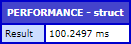
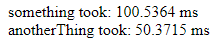
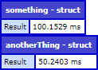
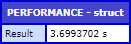

# A ColdFusion custom tag to conveniently measure the time it takes to execute code

Need to know how much time a function or code block takes? Tired of typing tick deltas over and over? Let me introduce `<cf_performance>` to you!

## It's simple!

```cfml
<cf_performance>

	<cfset doSomething()>
	<cfset doAnotherThing()>

</cf_performance>
```



Measures the total time it took to execute everything between the start end end tag.

## How to make custom tags work

Whenever ColdFusion parses a tag that starts with `<cf_`, it will automatically check for a `.cfm` file with the tag's name in the directory of the template it appears in. Example: `<cf_performance>` will look for `performance.cfm`. To make custom tags available to the whole application, use `Application.cfc` and specify the directory with the custom tag file using `this.customTagPaths` (that's a list variable). You can also add a global entry in the ColdFusion admin to make it available on the whole server.

### Example: How to unlock `cf_performance` in your Application

1. Store the `performance.cfm` in a folder called `mytags` in the root of your web app.

2. Open your `Application.cfc`:
```cfml
<cfcomponent>

	<cfset THIS.customTagPaths = expandPath("/mytags/")>

</cfcomponent>
```

3. Done!

## Optional Tag Attributes

### `variable`

If you don't want to immediately dump the result, you can store it in a variable and print it later:

```cfml
<cf_performance variable="x">
	<cfset doSomething()>
</cf_performance>
<cf_performance variable="y">
	<cfset doAnotherThing()>
</cf_performance>

<cfoutput>
	something took: #x#<br>
	anotherThing took: #y#<br>
</cfoutput>
```



### `type`

- `dump`: dumps the result as struct
- `inline`: outputs the result as string
- `outline`: outputs the result within `<fieldset>`
- `comment`: outputs the result within `<!-- HTML comment -->`

Default type is `dump`.

### `label`

Label multiple measurements to distinguish between them more easily:

```cfml
<cf_performance label="something">
	<cfset doSomething()>
</cf_performance>
<cf_performance label="anotherThing">
	<cfset doAnotherThing()>
</cf_performance>
```



Default label is `PERFORMANCE`.

### `abort`

Similar to `cfdump`'s abort attribute, you can immediately abort the request after measuring performance:

```cfml
<cf_performance abort>
	<cfset doSomething()>
</cf_performance>
```

### `returnType`

Use different return types to read big numbers more easily:

```cfml
<cf_performance returnType="s">
	<cfset thisTakesMultipleSeconds()>
</cf_performance>
```



By default, the return type will automatically choose between `ms` and `s`.<br>
Supported return types are: `ns`, `μs`, `ms`, `s`

### `nano`

By default, the performance is measured using Java's `System.nanoTime()`.<br>
If you don't need this much precision, you can also measure with ColdFusion's `getTickCount()`.

```cfml
<cf_performance nano="false">
	<cfset doSomething()>
</cf_performance>
```

## I hate typing!

If `<cf_performance>` is too much to type, just rename the file to something shorter.

Renaming `performance.cfm` to `perf.cfm`:
```cfml
<cf_perf>
	<cfset doSomething()>
</cf_perf>
```

## A note about micro benchmarking

This custom tag is not suited to be used for micro benchmarking. You probably shouldn't micro-bench in ColdFusion anyway. Use `cf_performance` to get a rough idea of how much time the execution of your code takes, but **use a proper profiler to identify the issue in detail**.